# SageMaker Sandbox handson

@(Handson)


## Step1 CloudFormationによる環境作成
事前に配布した２つのYAMLファイルのCloudFormation テンプレートを実行します、
* sandbox-landing.yaml
* sandbox-sandbox.yaml

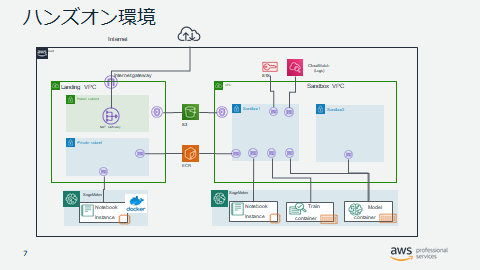


管理コンソールからCloudFormationのサービスを選択
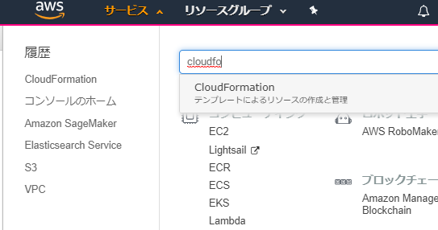


##### Landingのスタック作成 

1.  「新しいスタックの作成」を選択


2. 「Amazon S3 テンプレート URL の指定」で
 `https://s3-ap-northeast-1.amazonaws.com/kh-handsondata/cfn/sandbox-landing.yaml` を指定し、「次へ」
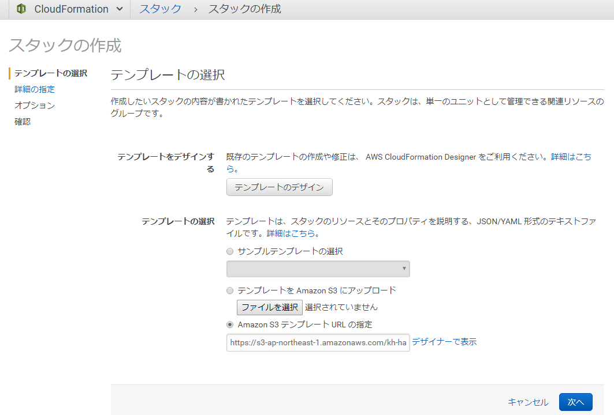

3. スタックの名前に  ”WS1” を入れて「次へ」 


4.   デフォルトのまま「次へ」


5.  **「AWS CloudFormation によってカスタム名のついた IAM リソースが作成される場合があることを承認します。」** のチェックをオンにして、「作成」


##### Sandboxのスタック作成 
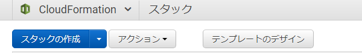

6. 「新しいスタックの作成」を選択し、「「Amazon S3 テンプレート URL の指定」で
 `https://s3-ap-northeast-1.amazonaws.com/kh-handsondata/cfn/sandbox-sandbox.yaml` を指定する
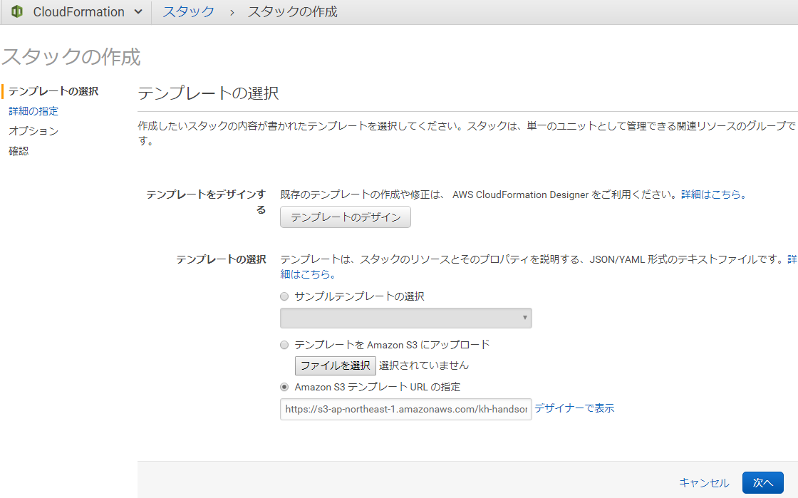

7.  スタック名を 「WS2」にして同様に作成する
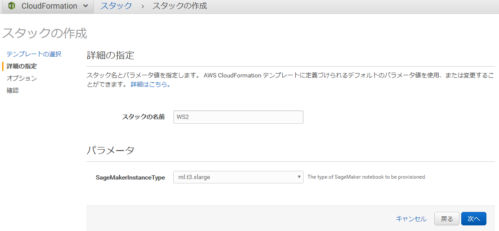

8. **「AWS CloudFormation によってカスタム名のついた IAM リソースが作成される場合があることを承認します。」** にチェックをオンにして、「作成」
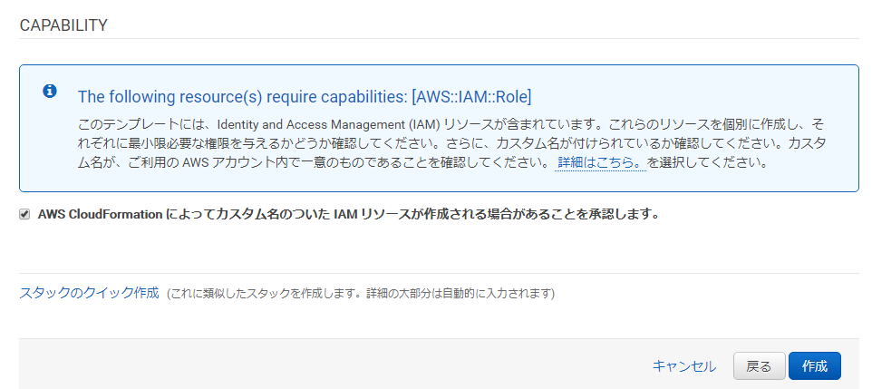


9.  スタックが CREATE_COMPLETE になれば完成

 
##### 確認
* WS1/WS2 の2つのVPCが作成されている


* WS1/WS2 の４つのサブネットが作成されている
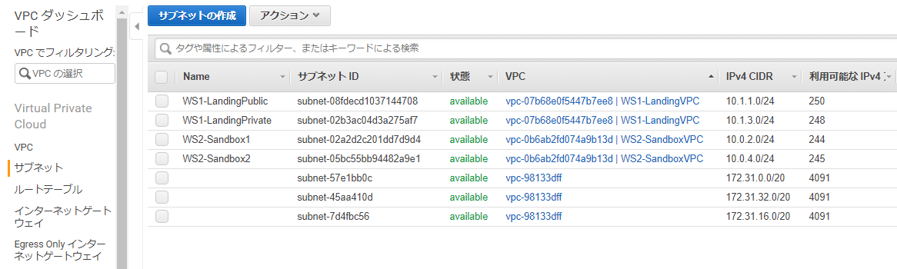

* endpointインターフェースが作成されている
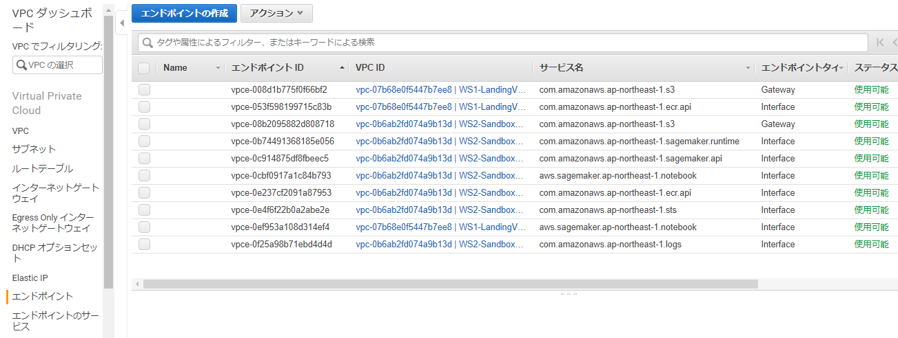

 
* ２つの Notebook インスタンスが作成されている
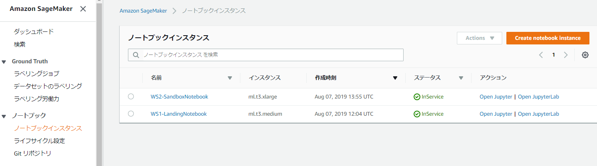


## Step2 カスタムコンテナ作成
Amazon SageMaker > ノートブックインスタンス
* WS1-LandingNotebook インスタンスで　Open Jupyter をクリック
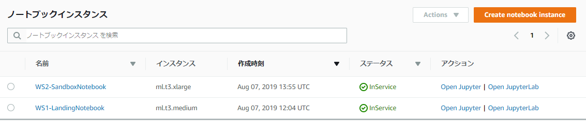

* /khlab-handson/scikit_custom/ create_docker.ipynb をオープン
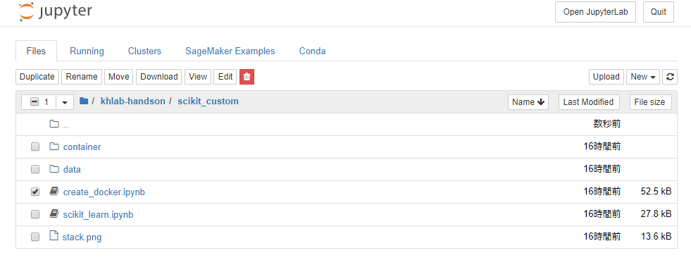

* notebookに従って、一行ずつに実行
Shift + Enter でカーソル行を実行します。
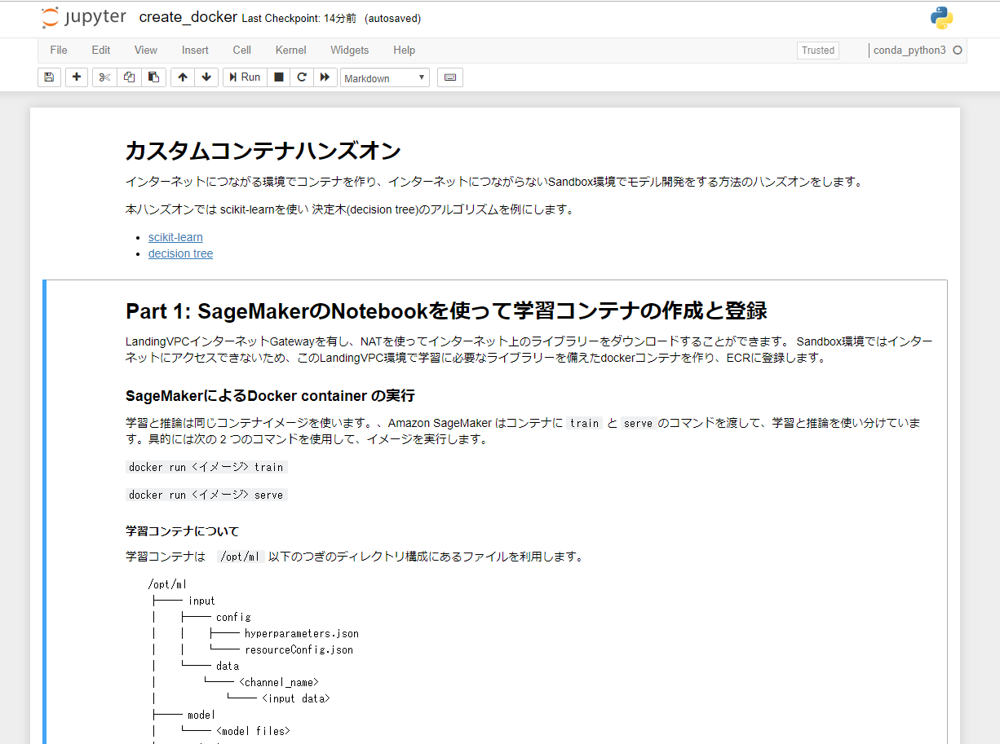

* docker push が成功すればOK
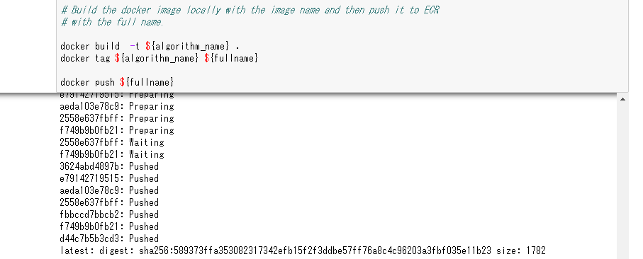

* Notebookを最後まで実行し、S3に関連ファイルをアップロードする


このS3のパスをつぎのステップで使います。　パスをメモ帳などにコピー＆ペストしておいてください。

#### 確認
* ECRにイメージが登録されていることを確かめる
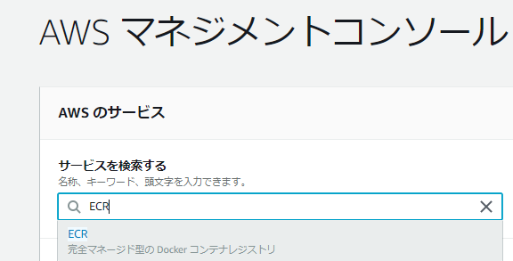

ECR > リポジトリ
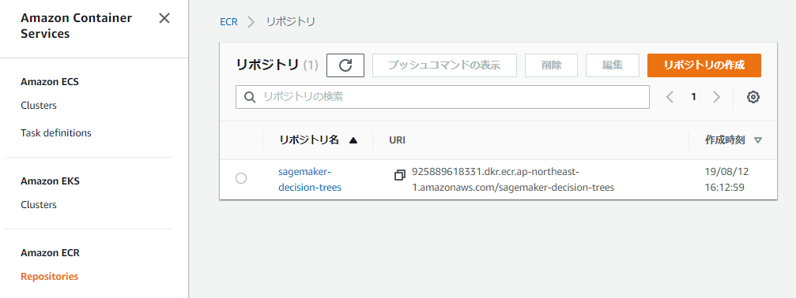


## Step3 Sandbox環境でモデル学習と推論デプロイ
Amazon SageMaker > ノートブックインスタンス
WS2-SandboxNotebook インスタンスで　Open Jupyter をクリック


### 準備作業
* Jupyter からTerminalをオープン

 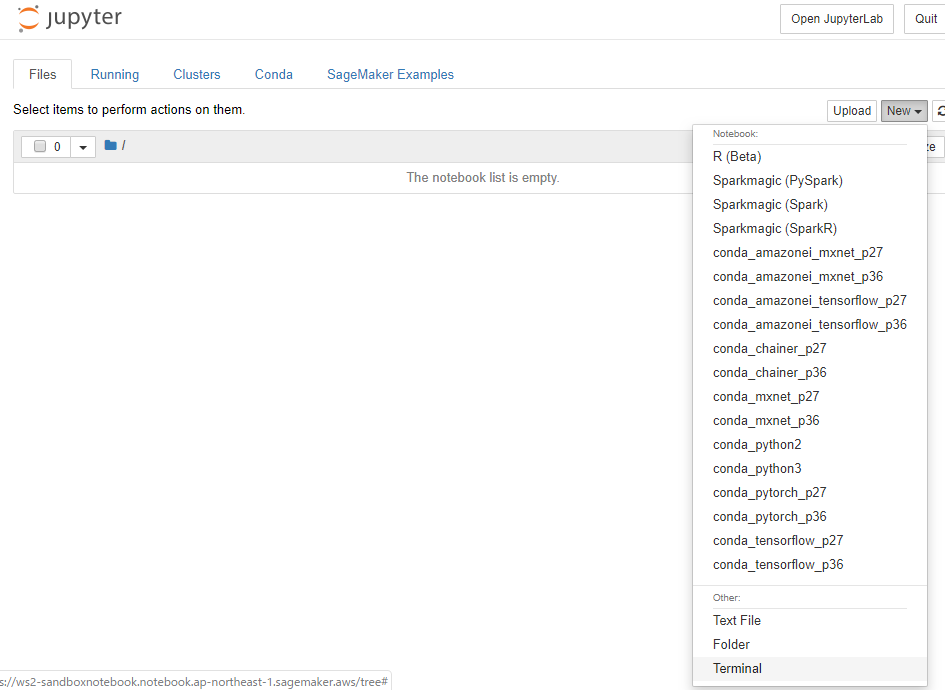


* S3からnotebook関連ファイルをコピー
Files > New > Terminal 
Terminal で次のコマンドを実行します。
以下の**S3のパス**は、Step２でアップロードしたパスに置き換えてください。
```
cd SageMaker
aws s3 cp --recursive  s3://sagemaker-ap-northeast-1-<アカウントID>/LAB-handson sciket-custom
```


### endpoints.jsonを修正
/home/ec2-user/anaconda3/envs/python3/lib/python3.6/site-packages/botocore/data/endpoints.json
 の hostnameにVPC endpointのホスト名を追記していく

* VPC > エンドポイント
WS2でフィルターをかけて、WS2-SandboxVPCのエンドポイントのみを表示する
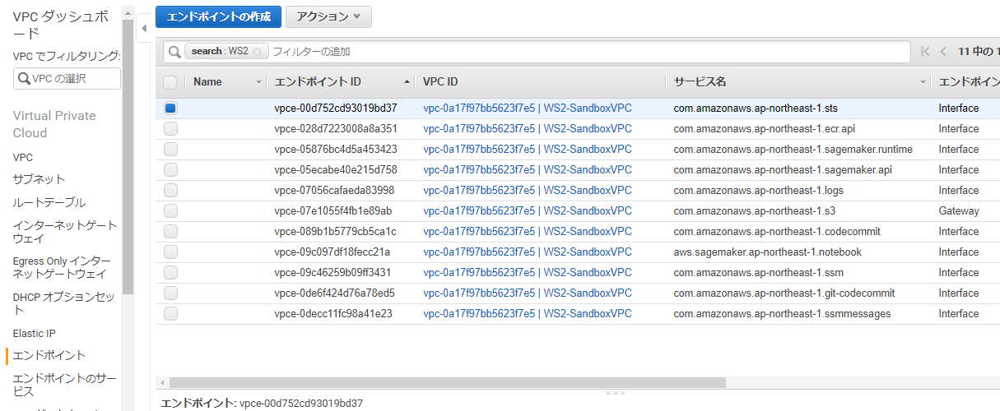


* エンドポイントを選択して詳細を表示する
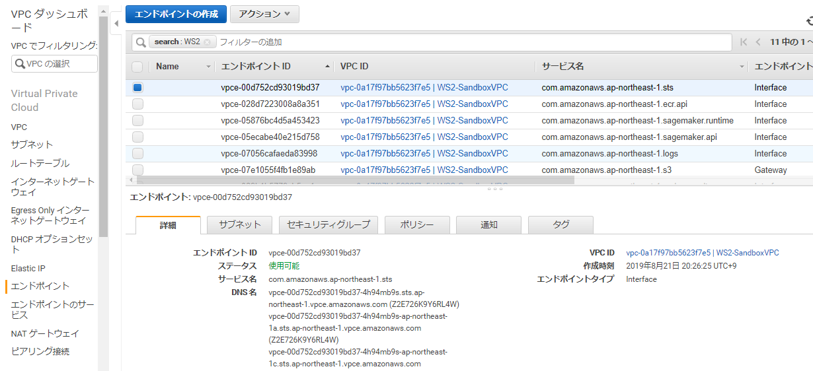

* エンドポイントの詳細にあるDNS名を１つ選んで、endpoints.jsonの該当サービスのhostnameとして登録していく
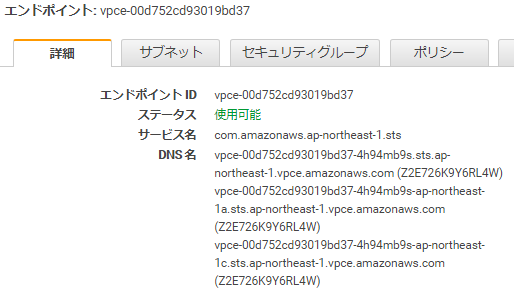

* 登録するエンドポイント
 *  sts
 * logs
 * notebook
 * api.sagemaker
 * runtime.sagemaker
 *  api.ecr


* endpoints.jsonにhostname登録の例
/home/ec2-user/anaconda3/envs/python3/lib/python3.6/site-packages/botocore/data/endpoints.json
エンドポイントのDNS名(vpceで始まる)を　`hostname` として 追加した例です。

```
      "sts" : {
        "defaults" : {
          "credentialScope" : {
            "region" : "ap-northeast-1"
          },
          "hostname" : "vpce-07a04bf233a7bbccb-yxh1tfbr.sts.ap-northeast-1.vpce.amazonaws.com" 
        },
        "endpoints" : {
          "ap-east-1" : {
            "credentialScope" : {
              "region" : "ap-east-1"
            },
            "hostname" : "sts.ap-east-1.amazonaws.com"
          },
          "ap-northeast-1" : {
            "credentialScope" : {
              "region" : "ap-northeast-1"
            },
            "hostname" : "vpce-07a04bf233a7bbccb-yxh1tfbr.sts.ap-northeast-1.vpce.amazonaws.com"
          },
```
```
      "api.sagemaker" : {
        "endpoints" : {
          "ap-northeast-1" : {
            "hostname" : "vpce-0a8e80e89e089bef4-0oxjfya5.api.sagemaker.ap-northeast-1.vpce.amazonaws.com"
          },
```

```
      "logs" : {
        "endpoints" : {
          "ap-east-1" : { },
          "ap-northeast-1" : {
             "hostname" : "vpce-07b1d8b6b579c9244-9xycdsvm.logs.ap-northeast-1.vpce.amazonaws.com"
          },          
```

```
      "runtime.sagemaker" : {
        "endpoints" : {
          "ap-northeast-1" : {
            "hostname" : "vpce-0b91622fd0b7b989a-xi93pg1w.runtime.sagemaker.ap-northeast-1.vpce.amazonaws.com"
          }
        }
      },
```
```
      "api.ecr" : {
        "endpoints" : {
          "ap-east-1" : {
            "credentialScope" : {
              "region" : "ap-east-1"
            },
            "hostname" : "api.ecr.ap-east-1.amazonaws.com"
          },
          "ap-northeast-1" : {
            "credentialScope" : {
              "region" : "ap-northeast-1"
            },
            "hostname" : "vpce-0a1d76bfb01161444-m5pyrmpt.api.ecr.ap-northeast-1.vpce.amazonaws.com "
          },
```

### モデル学習の実行
* / scikit-custom / scikit-learn.ipynb を開く
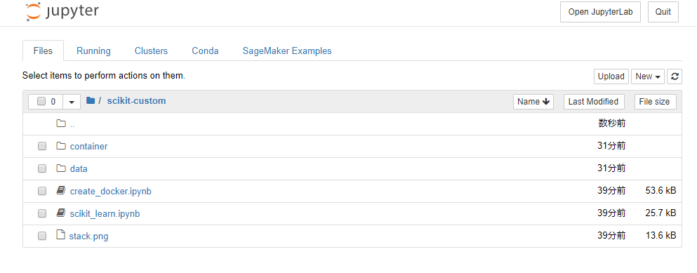


* notebookに従って、一行ずつに実行
Shift + Enter でカーソル行を実行します。
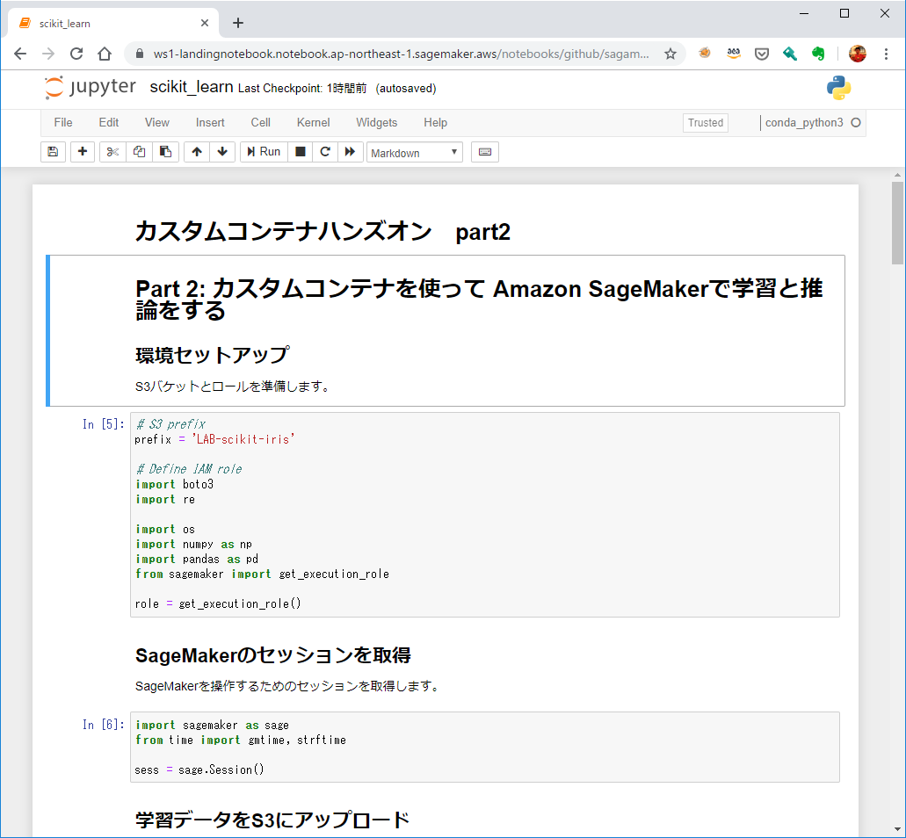


